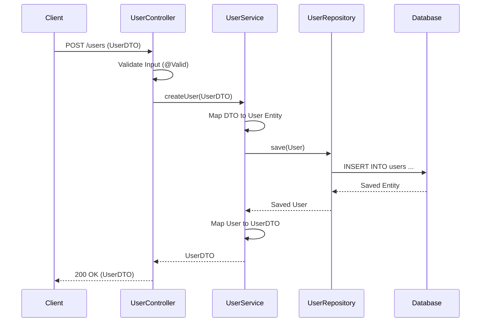
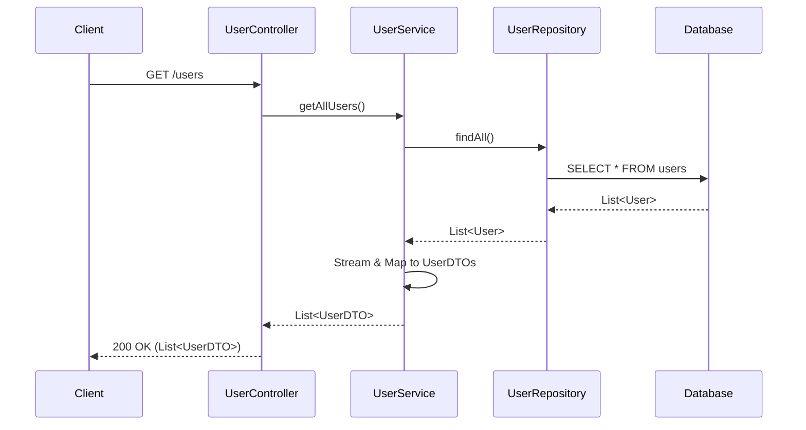
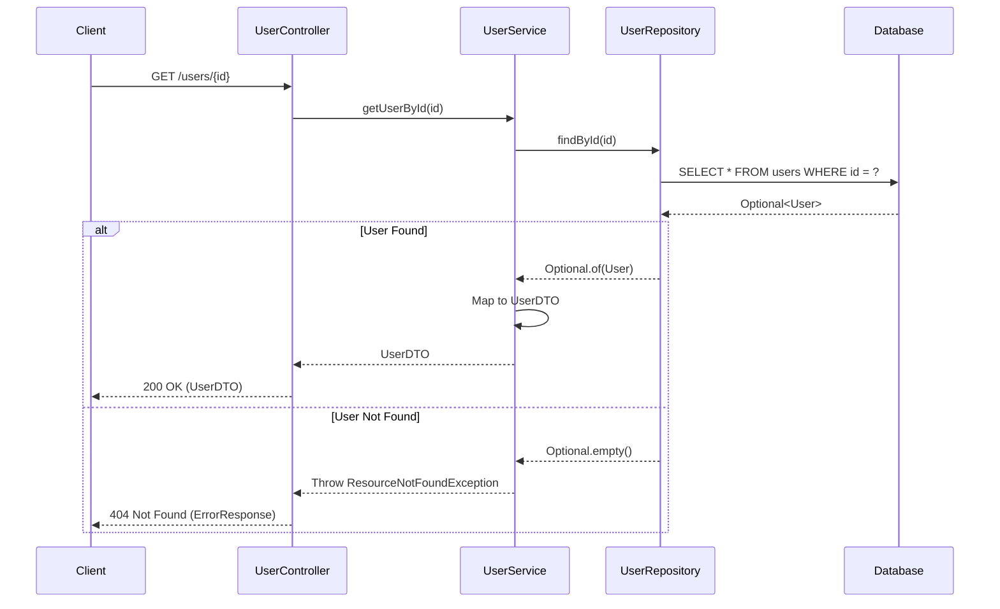
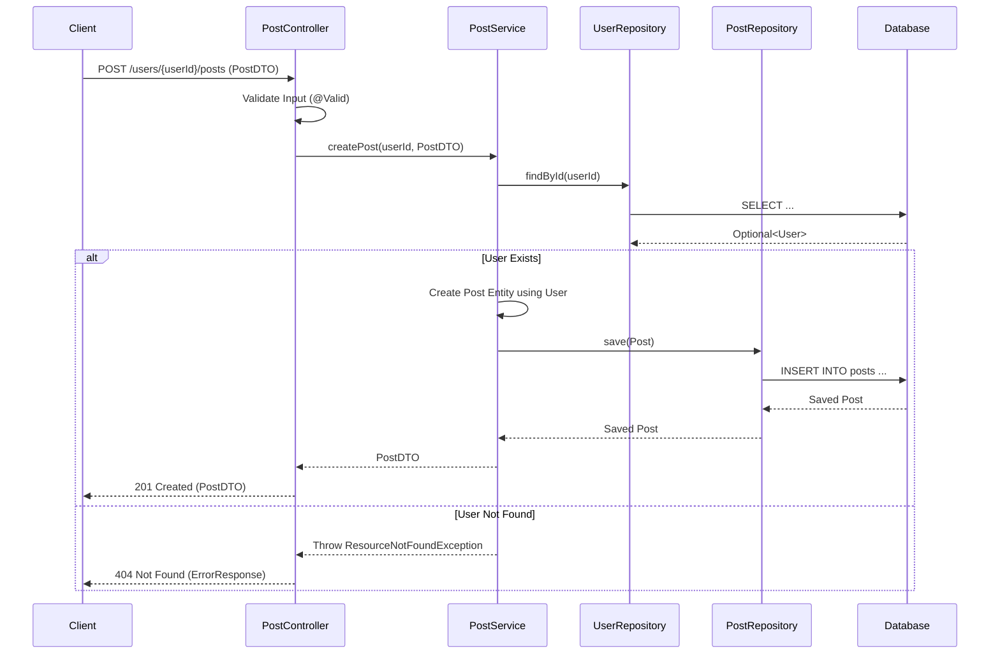
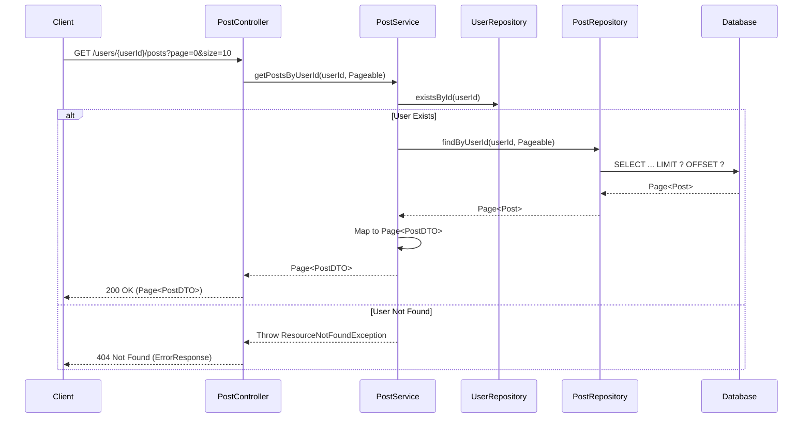

# API Flows and Diagrams

This document outlines the end-to-end execution flow for the key API endpoints in the system.

## 1. User Management

### 1.1 Create User
**Endpoint:** `POST /users`

**Flow:**
1.  Client sends `POST /users` with user details (JSON).
2.  `UserController` validates the Input (`@Valid`).
3.  `UserService` creates a new `User` entity.
4.  `UserRepository` saves the entity to the DB.
5.  `UserService` maps the saved entity to `UserDTO` and returns it.

### 1.2 Get All Users
**Endpoint:** `GET /users`

### 1.3 Get User by ID
**Endpoint:** `GET /users/{id}`

- Handles `ResourceNotFoundException` if user doesn't exist.

---

## 2. Post Management

### 2.1 Create Post
**Endpoint:** `POST /users/{userId}/posts`

- Ensures the User exists before creating a post.

### 2.2 Get Posts by User (Paginated)
**Endpoint:** `GET /users/{userId}/posts?page=0&size=10`

- Returns a `Page<PostDTO>`.

