# API Flows and Diagrams

This document outlines the end-to-end execution flow for the key API endpoints in the system.

## 1. User Management

### 1.1 Create User
**Endpoint:** `POST /users`

**Flow:**
1.  Client sends `POST /users` with user details (JSON).
2.  `UserController` validates the Input (`@Valid`).
3.  `UserService` creates a new `User` entity.
4.  `UserRepository` saves the entity to the DB.
5.  `UserService` maps the saved entity to `UserDTO` and returns it.

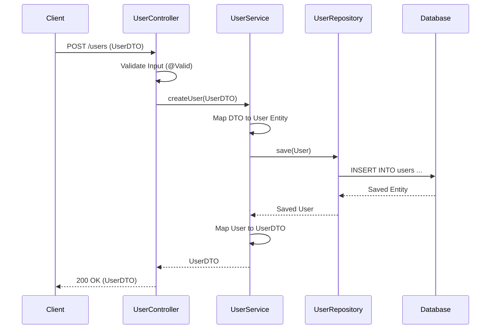

### 1.2 Get All Users
**Endpoint:** `GET /users`

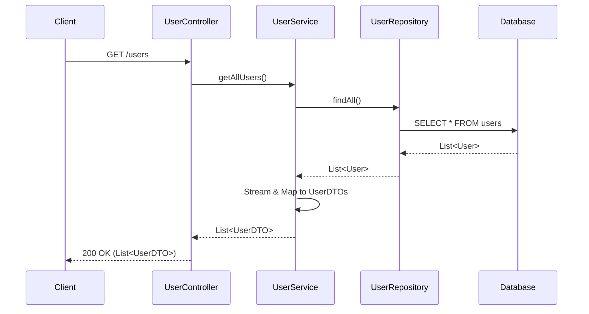

### 1.3 Get User by ID
**Endpoint:** `GET /users/{id}`

- Handles `ResourceNotFoundException` if user doesn't exist.

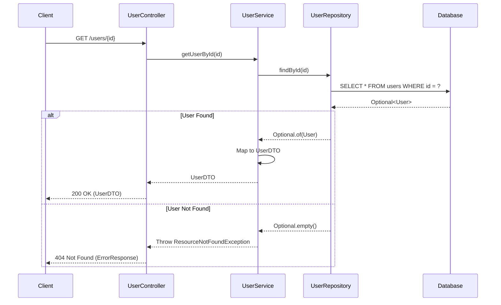

---

## 2. Post Management

### 2.1 Create Post
**Endpoint:** `POST /users/{userId}/posts`

- Ensures the User exists before creating a post.

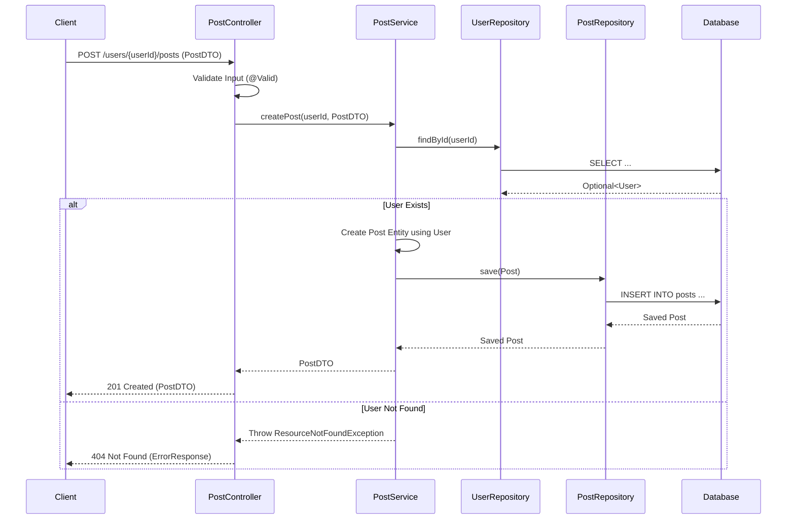

### 2.2 Get Posts by User (Paginated)
**Endpoint:** `GET /users/{userId}/posts?page=0&size=10`

- Returns a `Page<PostDTO>`.

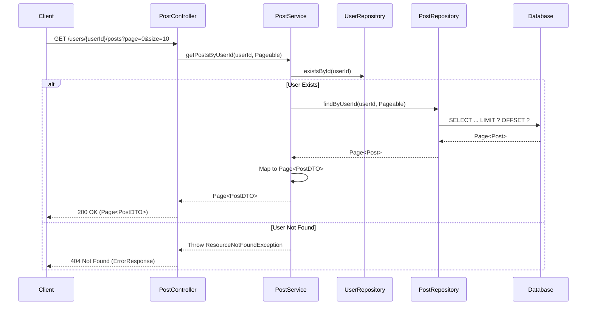

---

## 3. Comment Management

### 3.1 Add Comment
**Endpoint:** `POST /comments`

**Flow:**
1.  Client sends `POST /comments` with `CommentDTO` (text, userId, postId).
2.  `CommentController` calls service.
3.  `CommentService` verifies User and Post exist.
4.  `CommentService` creates and saves `Comment` entity.
5.  Returns created `CommentDTO`.

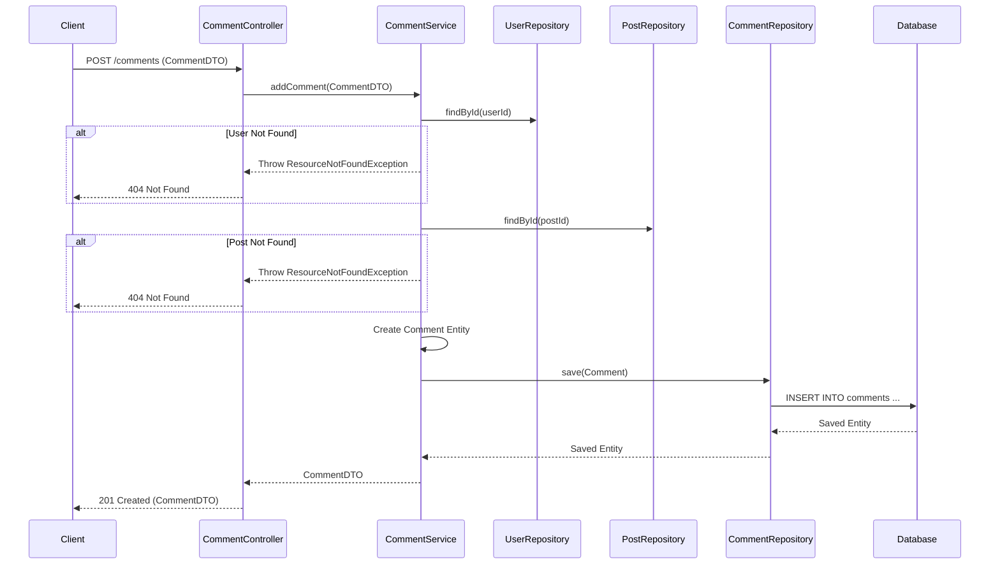

### 3.2 Get Comments by Post (HQL)
**Endpoint:** `GET /comments/post/{postId}`

- Uses **HQL** to fetch comments and associated users in a single query (`JOIN FETCH`).

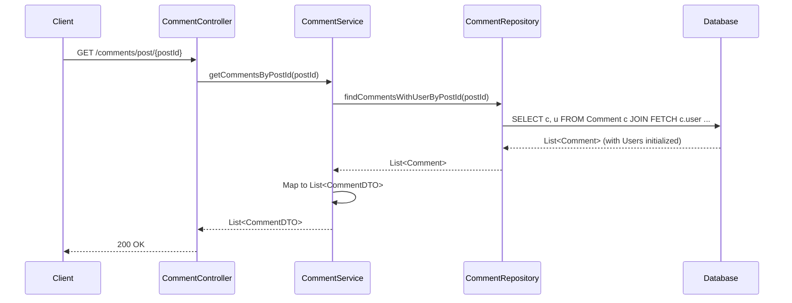

---

## 4. Like Management

### 4.1 Like a Post
**Endpoint:** `POST /likes`

**Flow:**
1. Check if user already liked the post.
2. Verify User and Post exist.
3. Save `PostLike` entity.

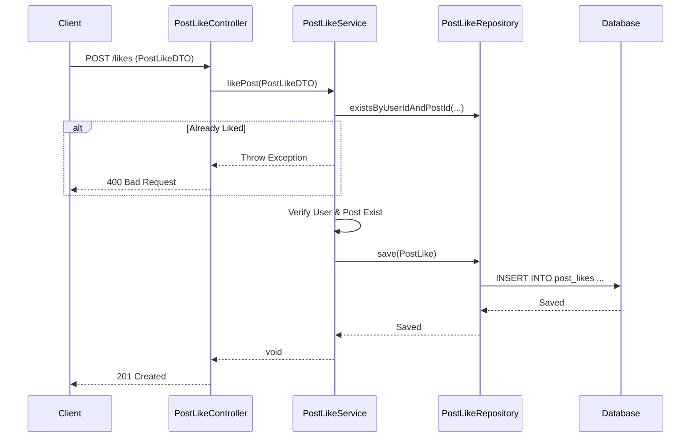

### 4.2 Count Likes (Native Query)
**Endpoint:** `GET /likes/post/{postId}/count`

- Uses **Native SQL** for performance.

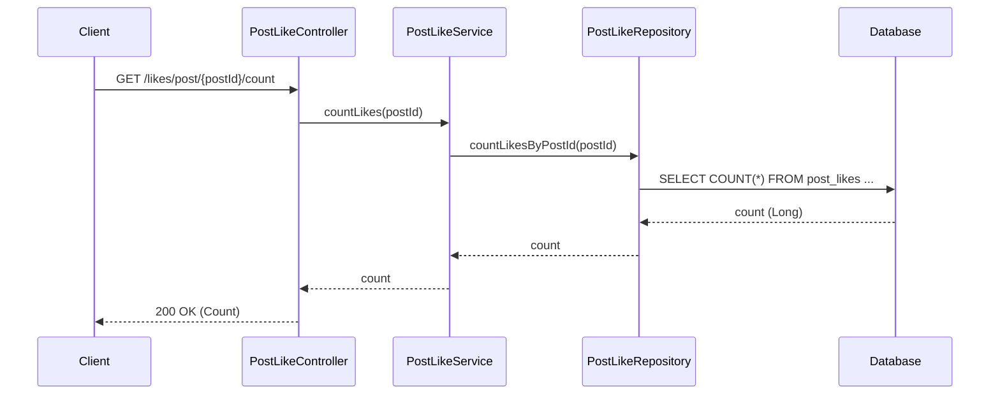

---

## 5. Reports (Native Queries)

### 5.1 Top Active Users
**Endpoint:** `GET /reports/active-users`

- Uses complex **Native SQL** with `JOIN` and `GROUP BY`.
- Maps result to `UserActivityReportDTO` interface.

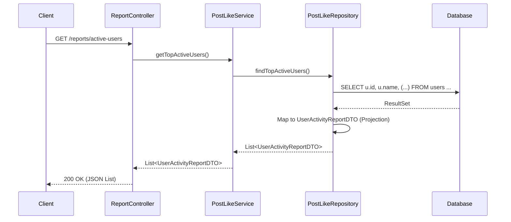

---

## 6. Category Management

### 6.1 Create Category
**Endpoint:** `POST /categories`

**Flow:**
1. Client sends `POST /categories` with name and description.
2. `CategoryController` calls `CategoryService`.
3. `CategoryService` saves the entity.
4. Returns created `CategoryDTO`.

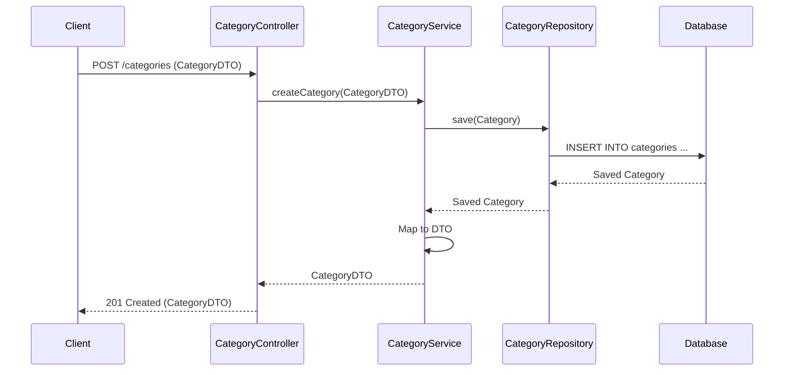

### 6.2 Get All Categories
**Endpoint:** `GET /categories`

- Returns a list of all categories.

### 6.3 Get Posts by Category
**Endpoint:** `GET /categories/{id}/posts`

- Returns all posts belonging to a specific category.

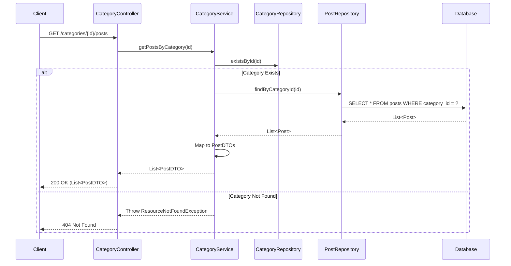
