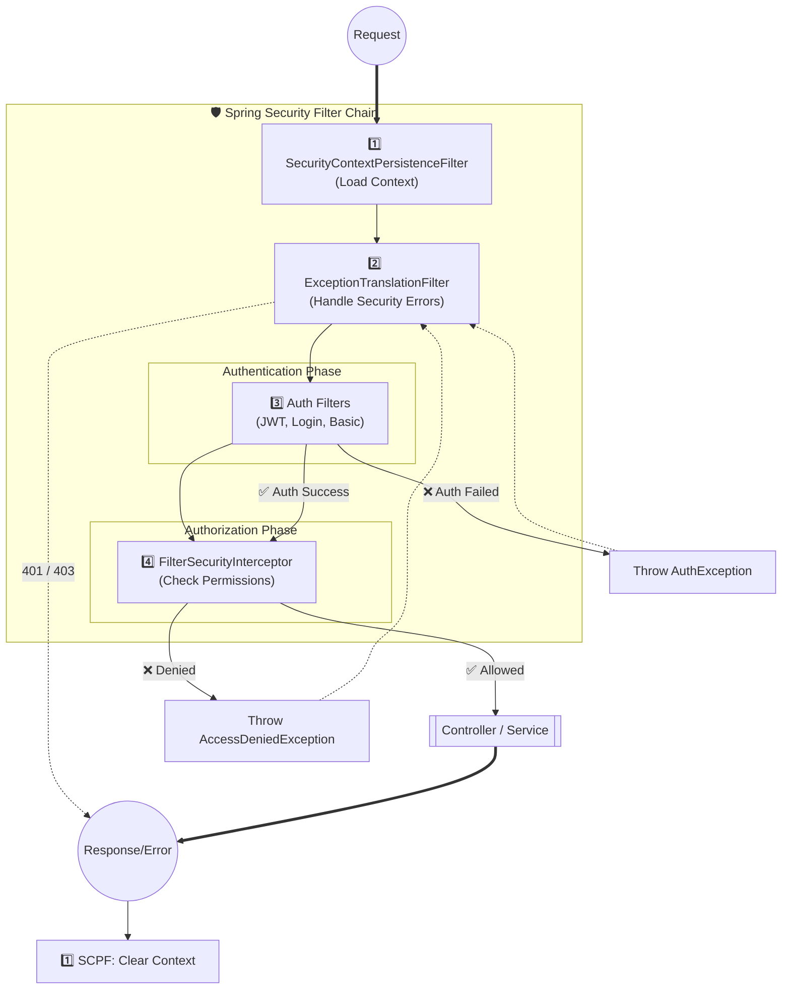

# 🧱 2. Spring Security Filters — Internals (Explained Simply)

---

## 🎨 Visual Flow Diagram




## 🔁 First: Big Mental Model (Very Important)

For **every HTTP request**:

```
Request
 ↓
[ Filter 1 ]
 ↓
[ Filter 2 ]
 ↓
[ Filter 3 ]
 ↓
Controller
 ↓
Response (filters run again in reverse)
```

Some filters:

* **Read data**
* Some **authenticate**
* Some **authorize**
* Some **handle errors**

---

## 2.1 Default Filters You MUST Know

We’ll go in **real execution order**, not alphabet order.

---

## 1️⃣ SecurityContextPersistenceFilter

📌 **Runs at the VERY START and VERY END**

### What it does (simple words)

* Loads `SecurityContext` **before request**
* Saves / clears `SecurityContext` **after response**

---

### Why this filter exists

Spring Security needs a place to:

* Store logged-in user
* Make it available to all other filters

So it does:

```
Request start:
  Load SecurityContext → ThreadLocal

Request end:
  Clear SecurityContext → avoid leaks
```

---

### Flow example

```
Incoming request
 ↓
SecurityContextPersistenceFilter
 ↓
SecurityContextHolder.setContext(...)
```

At the end:

```
Response
 ↑
SecurityContextHolder.clearContext()
```

✔ Prevents one user leaking into another request
✔ Extremely important in multi-threaded servers

---

## 2️⃣ UsernamePasswordAuthenticationFilter

📌 **Form login filter**

### What it does

* Handles `/login`
* Reads:

  * username
  * password
* Triggers authentication

---

### When does it run?

ONLY when:

```
POST /login
```

Otherwise → it skips.

---

### Internal flow (very important)

```
1. Read username + password
2. Create Authentication object (unauthenticated)
3. Pass to AuthenticationManager
4. If success:
      set Authentication into SecurityContext
   If failure:
      throw AuthenticationException
```

---

### Mental model

> “User submitted login form — let me verify credentials.”

---

## 3️⃣ BasicAuthenticationFilter

📌 **HTTP Basic Auth**

### What it does

* Looks for header:

```
Authorization: Basic dXNlcjpwYXNz
```

* Decodes username & password
* Authenticates user

---

### When used

Mostly for:

* Internal services
* Tools
* Simple APIs

❌ Not common in modern JWT apps
✔ Still common in interviews

---

### Key difference vs UsernamePasswordAuthenticationFilter

| Filter                               | Trigger                                   |
| ------------------------------------ | ----------------------------------------- |
| UsernamePasswordAuthenticationFilter | `/login`                                  |
| BasicAuthenticationFilter            | Every request with `Authorization: Basic` |

---

## 4️⃣ BearerTokenAuthenticationFilter

📌 **JWT / OAuth2 token authentication**

### What it does

* Looks for:

```
Authorization: Bearer <JWT>
```

* Validates token
* Loads user
* Sets Authentication in SecurityContext

---

### JWT flow inside this filter

```
1. Extract token
2. Validate signature & expiry
3. Extract username / claims
4. Load user details
5. Create authenticated Authentication
6. Store in SecurityContext
```

✔ Stateless
✔ No session
✔ Runs on EVERY request (if token present)

---

### 🔥 Where YOUR custom JWT filter usually lives

➡️ **Same place as BearerTokenAuthenticationFilter**
➡️ Before authorization filters

---

## 5️⃣ AnonymousAuthenticationFilter

📌 **Creates a fake user (yes, really)**

### Why this exists

Spring Security **hates null Authentication**.

So if:

* No login
* No JWT
* No Basic auth

It creates:

```
Authentication:
  principal = "anonymousUser"
  authorities = ROLE_ANONYMOUS
```

---

### Why this is useful

It allows rules like:

```java
hasRole("USER")
```

Instead of:

```java
authentication != null
```

✔ Everything is consistent
✔ No null checks everywhere

---

## 6️⃣ ExceptionTranslationFilter

📌 **The error translator**

### What it does

It **does NOT authenticate or authorize**.

It only:

* Catches security exceptions
* Converts them into HTTP responses

---

### What it handles

| Exception               | Result           |
| ----------------------- | ---------------- |
| AuthenticationException | 401 Unauthorized |
| AccessDeniedException   | 403 Forbidden    |

---

### Example

```
JWT missing
 ↓
AuthenticationException thrown
 ↓
ExceptionTranslationFilter
 ↓
HTTP 401 returned
```

Without this filter → ugly stack traces 💥

---

## 7️⃣ FilterSecurityInterceptor

📌 **FINAL BOSS — Authorization happens here**

### What it does

* Checks:

  * Roles
  * Permissions
  * Annotations
* Decides:

  * ALLOW
  * DENY

---

### What it evaluates

* `@PreAuthorize`
* `hasRole()`
* URL rules (`/admin/**`)
* Method security

---

### Example

```java
@PreAuthorize("hasRole('ADMIN')")
@GetMapping("/admin")
```

Flow:

```
Authentication exists?
 ↓
Has ROLE_ADMIN?
 ↓
YES → controller
NO → AccessDeniedException
```

---

## 2.2 Filter Order & Flow (End-to-End)

### Simplified Real Order

```
SecurityContextPersistenceFilter
 ↓
BearerTokenAuthenticationFilter / JWT Filter
 ↓
UsernamePasswordAuthenticationFilter
 ↓
BasicAuthenticationFilter
 ↓
AnonymousAuthenticationFilter
 ↓
ExceptionTranslationFilter
 ↓
FilterSecurityInterceptor
```

---

## Request → Response Timeline

### Successful JWT request

```
Request
 ↓
SecurityContext loaded
 ↓
JWT validated
 ↓
Authentication stored
 ↓
Authorization passed
 ↓
Controller
 ↓
Response
 ↓
SecurityContext cleared
```

---

## Where JWT Filter Fits (Interview Favorite)

✅ **After** `SecurityContextPersistenceFilter`
✅ **Before** `FilterSecurityInterceptor`

Why?

* Auth must happen **before authorization**

---

## How Exceptions Are Handled Inside Filters

### Authentication failure

```
JWT invalid
 ↓
AuthenticationException
 ↓
ExceptionTranslationFilter
 ↓
401 Unauthorized
```

---

### Authorization failure

```
User authenticated
 ↓
ROLE missing
 ↓
AccessDeniedException
 ↓
ExceptionTranslationFilter
 ↓
403 Forbidden
```

---

## How Authentication Failures Propagate

Important rule:

> **Filters don’t return responses — they THROW exceptions**

Those exceptions:

* Bubble up
* Get translated
* Become HTTP responses

✔ Clean separation
✔ Easy to customize

---

## 🔚 Final One-Line Summary (Memorize This)

> **Authentication filters create Authentication
> Authorization filter (FilterSecurityInterceptor) checks it
> ExceptionTranslationFilter converts failures into HTTP codes**
