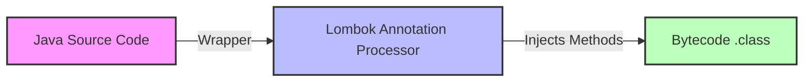
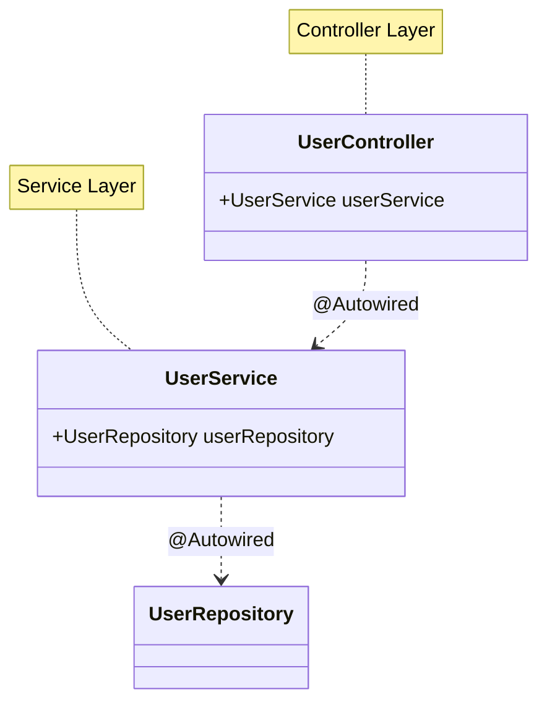
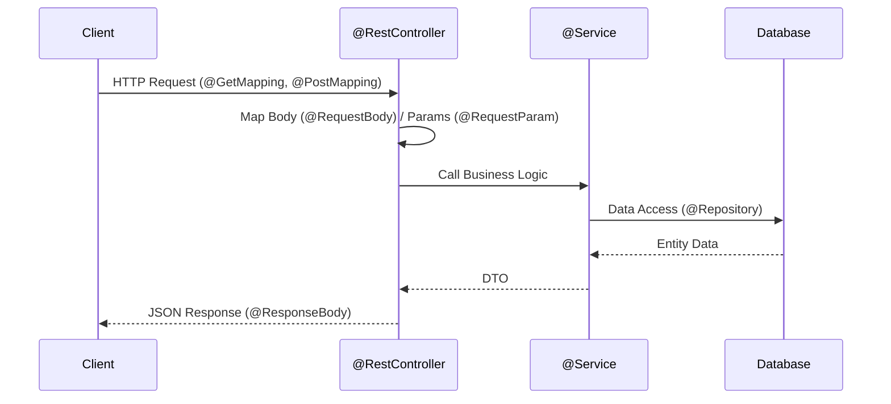
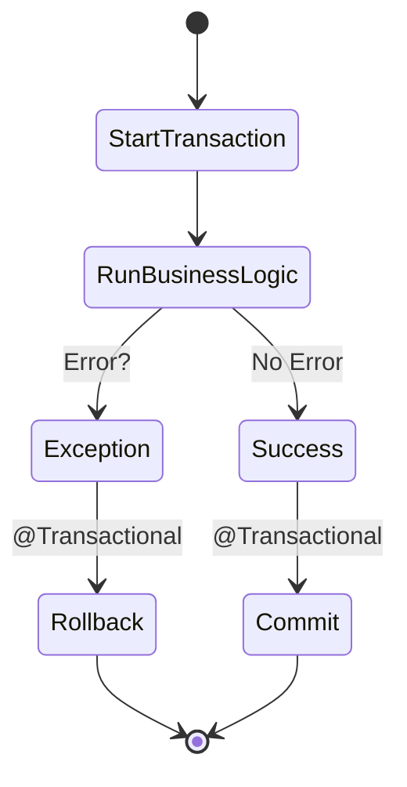

# 📚 Complete Spring Boot & Java Annotations Guide

This guide covers the most essential annotations used in Spring Boot development, from Lombok to JPA to Core Spring.

---

## 🛠️ Lombok Annotations (Boilerplate Killer)

**Lombok** is a library that generates boilerplate code (getters, setters, constructors) at compile time.



### 1️⃣ `@Getter` and `@Setter`
Generates getters and setters for fields.
```java
@Getter @Setter
public class User {
    private String name;
}
// Generates: getName(), setName(String name)
```

### 2️⃣ `@NoArgsConstructor` & `@AllArgsConstructor`
Generates constructors.
*   `@NoArgsConstructor`: Empty constructor (Essential for JPA/Hibernate).
*   `@AllArgsConstructor`: Constructor with all fields.

### 3️⃣ `@ToString`
Generates a `toString()` method including all fields.
*   **Tip**: Use `@ToString.Exclude` on fields to prevent infinite recursion (e.g., in bidirectional relationships).

### 4️⃣ ⭐ `@Data` (The Big One)
Combines `@Getter`, `@Setter`, `@ToString`, `@EqualsAndHashCode`, and `@RequiredArgsConstructor`.
*   **⚠️ WARNING**: Avoid using `@Data` on **JPA Entities**. The `hashCode()` and `equals()` implementation can cause severe issues with Hibernate. Use `@Getter` + `@Setter` + `@ToString` instead.

### 5️⃣ `@Builder`
Implements the Builder pattern for easy object creation.
```java
User user = User.builder().name("Arashad").email("a@test.com").build();
// versus
User user = new User("Arashad", "a@test.com", ...); // Constructor hell
```

### 6️⃣ `@Slf4j`
Auto-generates a logger field.
```java
@Slf4j
public class MyService {
    public void doSomething() {
        log.info("Doing something..."); // 'log' is automatically available
    }
}
```

---

## 🍃 Core Spring Annotations

### 1️⃣ `@Component`
Generic stereotype for any Spring-managed component. Spring detects these classes during component scanning and creates beans for them.

```mermaid
graph TD
    subgraph Spring Container
    A((@Component))
    B((@Service))
    C((@Repository))
    D((@Controller))
    end
    B -->|extends| A
    C -->|extends| A
    D -->|extends| A
    style A fill:#f96,stroke:#333
```

### 2️⃣ `@Service`
A specialization of `@Component`. Use this for **Service Layer** classes (business logic).
*   Functionally same as `@Component` but adds semantic meaning.

### 3️⃣ `@Repository`
A specialization of `@Component` for **Data Access Layer** (DAOs).
*   **Feature**: Automatically translates database exceptions into Spring's `DataAccessException` hierarchy.

### 4️⃣ `@Controller`
A specialization of `@Component` for **Spring MVC Controllers**. Handles web requests.

### 5️⃣ `@Configuration`
Indicates a class declares one or more `@Bean` methods.
```java
@Configuration
public class AppConfig {
    @Bean
    public MyBean myBean() {
        return new MyBean();
    }
}
```

### 6️⃣ `@Bean`
Marks a method within a `@Configuration` class to define a bean. The return value is registered in the Spring ApplicationContext.

---

## 💉 Dependency Injection

### 1️⃣ `@Autowired`
Tells Spring to inject a dependency here.


*   **Constructors** (Recommended): No annotation needed if there's only one constructor.
*   **Fields** (Avoid): Hard to test.
*   **Setters**: Optional dependencies.

### 2️⃣ `@Qualifier`
Used with `@Autowired` to specify *which* bean to inject when multiple beans of the same type exist.
```java
@Autowired
@Qualifier("emailService") // vs "smsService"
private MessageService messageService;
```

### 3️⃣ `@Value`
Injects values from properties files (`application.properties`).
```java
@Value("${app.database.url}")
private String dbUrl;
```

### 4️⃣ `@Primary`
When multiple beans of the same type exist, the one marked `@Primary` will be chosen by default unless a `@Qualifier` is used.

---

## 🚀 Spring Boot Specifics

### 1️⃣ `@SpringBootApplication`
The starting point of a Spring Boot application. It triggers auto-configuration and component scanning.
It combines:
*   `@Configuration`
*   `@EnableAutoConfiguration`
*   `@ComponentScan`

---

## 🌐 Spring MVC & REST

### 1️⃣ `@RestController`
Combines `@Controller` and `@ResponseBody`.
*   Tells Spring that data returned by each method should be written straight into the response body (JSON/XML) instead of rendering a template.



### 2️⃣ `@RequestMapping`
Maps HTTP requests to handler methods. Can be used at class or method level.
```java
@RequestMapping("/api/v1/users")
public class UserController { ... }
```

### 3️⃣ `@GetMapping`, `@PostMapping`, `@PutMapping`, `@DeleteMapping`
Shortcuts for `@RequestMapping(method = RequestMethod.GET)`, etc.

### 4️⃣ `@RequestBody`
Maps the HTTP request body (JSON) to a Java object.
```java
public void createUser(@RequestBody UserDto userDto) { ... }
```

### 5️⃣ `@PathVariable`
Extracts values from the URI path.
```java
@GetMapping("/{id}")
public User getUser(@PathVariable("id") Long id) { ... }
```

### 6️⃣ `@RequestParam`
Extracts query parameters from the URL (e.g., `?search=foo`).
```java
public List<User> search(@RequestParam("search") String query) { ... }
```

### 7️⃣ `@CrossOrigin`
Enables Cross-Origin Resource Sharing (CORS) for the controller or specific method.
```java
@CrossOrigin(origins = "http://localhost:4200") // Allow Angular app
```

### 8️⃣ `@ResponseStatus`
Specifies the HTTP status code to return.
```java
@ResponseStatus(HttpStatus.CREATED) // 201
public void create() { ... }
```

---

## 🗄️ Data Access (JPA / Hibernate)

### 1️⃣ `@Entity`
Marks a class as a JPA entity (mapped to a database table).

### 2️⃣ `@Table`
Specifies the details of the table usage (name, schema, constraints).
```java
@Table(name = "t_users")
```

### 3️⃣ `@Id`
Marks the primary key field.

### 4️⃣ `@GeneratedValue`
Configures the way of increment of the specified column(field).
```java
@GeneratedValue(strategy = GenerationType.IDENTITY)
```

### 5️⃣ `@Column`
Specifies the details of the column to which a field or property will be mapped.
```java
@Column(name = "email_address", nullable = false, unique = true)
private String email;
```

### 6️⃣ `@Transient`
Specifies that a field is NOT to be persisted in the database.

### 7️⃣ `@OneToMany`, `@ManyToOne`, `@OneToOne`, `@ManyToMany`
Defines relationships between entities.
```java
@ManyToOne(fetch = FetchType.LAZY)
@JoinColumn(name = "department_id")
private Department department;
```

---

## 🔄 Transaction Management

### 1️⃣ `@Transactional`
Defines the scope of a single database transaction.
*   **Usage**: Put this on Service methods.
*   **Effect**: If the method throws a RuntimeException, the changes are **rolled back**. If it finishes successfully, changes are **committed**.



---

## 🧪 Testing

### 1️⃣ `@SpringBootTest`
Loads the complete Spring aplication context for integration tests.

### 2️⃣ `@MockBean`
Creates a Mockito mock for a bean and injects it into the ApplicationContext, replacing any existing bean of the same type.

### 3️⃣ `@Test`
JUnit annotation to mark a method as a test case.

---

## ✅ Validation (`javax.validation` / `jakarta.validation`)

### 1️⃣ `@Valid`
Triggers validation on nested objects or method parameters (often used with `@RequestBody`).

### 2️⃣ `@NotNull`
The element must not be null.

### 3️⃣ `@NotBlank`
The element must not be null and must contain at least one non-whitespace character.

### 4️⃣ `@Size`
Constrains the size of the element (Array, Collection, Map, String).
```java
@Size(min = 2, max = 50)
private String name;
```

### 5️⃣ `@Email`
Checks if the string is a valid email address.
